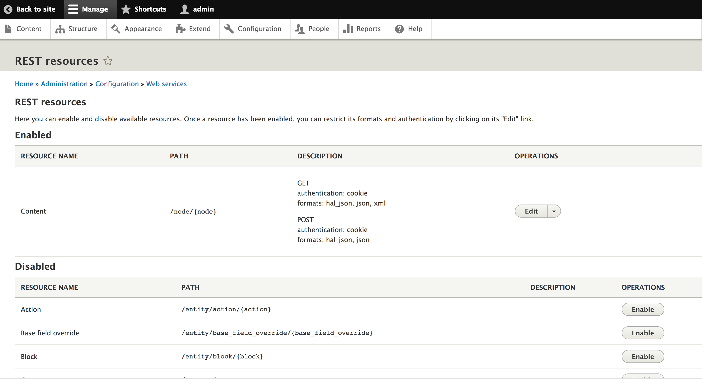
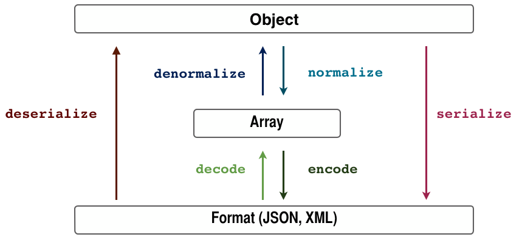

# Web APIs in Drupal 8  <!-- .element: class="front-title" -->

###Abhishek Anand
#### Sr. Technical Architect, ACQUIA


## About Me
* Drupaling since 2008
* Maintainer of modules like S3 File System, ShareThis, Migrate Upgrade and Video  
* Themer
* Certified D7 & D8 Grandmaster


## What are Web Services?

>Web Services make it possible for other applications to read and update information on your site via the Web. REST is one of a number of different ways of making Web Services available on your site. In contrast to other techniques such as SOAP or XML-RPC, REST encourages developers to rely on HTTP methods (such as GET and POST) to operate on resources (data managed by Drupal).


## REST (Hypermedia)

* Collection of Resources
* Resource identified by URI
* Resource represented in a format
* Manipulate through Verbs/Methods
* Known hyperlinks to other Resources


## Tutorial
<iframe width="560" height="315" src="https://www.youtube.com/embed/llpr5924N7E" frameborder="0" allowfullscreen></iframe>


## Looking back at Drupal 7
* Not supported by the core
* Anything beyond HTML was an after thought
* Depends on restful or services module
* Not easy to scale


## Whats in Drupal 8?

* The RESTful Web Services module is included in Drupal 8 core
* It is inspired by the Drupal 7 RESTful Web Services module 
* Works out of the box
* Everything is an HTTP Response, Sometimes that's a page
* You can serve any type of response to a request
* Wire directly to the routing system
* No duplicating routing anymore!


## Drupal 8 RESTful Drupal Core
   
* RESTful Web Services (rest)
* Serialization (serialization)
* Hypertext Application Language (hal)
* HTTP Basic Authentication (basic_auth)

Note: HAL is a simple format that gives a consistent and easy way to hyperlink between resources in your API.


# REST UI module
A user interface for Drupal 8's REST module.





# DEMO!


# Under the hood!


## RESTful Web Services modules

* Modules can expose additional resources
* Supports GET/POST/PATCH/DELETE (PUT is not supported for good reasons)
* Integrates with Drupal's role-based authentication system automatically: one permission per resource (and per verb)
* Modules can add authentication mechanisms, these are then be applied to any of the resources
* Modules can add more serialization formats 

Note: Put is not supported for a reason https://groups.drupal.org/node/284948


## Serialization
* The Serialization module provides a framework to add additional serialization formats simply by installing additional modules
* Drupal 8 core's HAL module adds support for HAL+JSON, 
* The CSV serialization contrib module adds CSV support.


Using Drupal 8's serializer service's (\Symfony\Component\Serializer\SerializerInterface) serialize() and deserialize() methods:

```php
$output = $this->serializer->serialize($entity, 'json');
$entity = $this->serializer->deserialize($output, \Drupal\node\Entity\Node::class, 'json');

```


## Serialization Workflow



## Normalization
* (array → object → array)
* normalizer (\Symfony\Component\Serializer\Normalizer\NormalizerInterface) 
* denormalizer (\Symfony\Component\Serializer\Normalizer\DenormalizerInterface), 


## Encoder
* Adds support for encoding to new serialization formats 

```
/**
* Adds CSV encoder support for the Serialization API.
*/
class CsvEncoder implements EncoderInterface, DecoderInterface {

public function encode($data, $format, array $context = array());

public function supportsEncoding($format);

public function decode($data, $format, array $context = array());

public function supportsDecoding($format);
```


## Authentication
* "Session cookies" is not the only way to authenticate user supported by drupal core
* New pluggable authentication system has been introduced


## Authentication provider services
  Implement 
  ```\Drupal\Core\Authentication\AuthenticationProviderInterface```
   and use the 'authentication_provider' service tag
 
 
## _auth option on routes
  The default authentication manager (see below) enables developers to limit the set of allowed authentication mechanisms to the specified subset by specifying _auth in a route's options

Example: 
```_auth: ['basic_auth', 'cookie']```


##Authentication manager

  The authentication manager calls the different authentication provider services based on each service's priority.
  The manager can be overridden for very advanced use cases; 99.9% of the times the default implementation should be sufficient.
  ```\Drupal\Core\Authentication\AuthenticationManager```


## Authentication Modules

* OAuth 
```https://www.drupal.org/project/oauth```
	
* Simple OAuth
```https://www.drupal.org/project/simple_oauth```

* IP Consumer Auth
```https://www.drupal.org/project/ip_consumer_auth```
	
* OAuth2 Server	
 ```https://www.drupal.org/project/oauth2_server```


## AuthenticationProviderInterface

```php
interface AuthenticationProviderInterface {
  
  * Checks whether suitable authentication credentials are on the request.
 public function applies(Request $request);
  
  * Authenticates the user.
 public function authenticate(Request $request);

}
```


```yaml
services:
 vtod_rest.authentication.none:
   class: Drupal\vtod_rest\Authentication\Provider\None
   arguments: ['@session_configuration', '@database']
   tags:
     - { name: authentication_provider, provider_id: 'none', priority: 200, global: TRUE }
```


## Custom REST Resource

* Setup a new custom Drupal module
* Create a new fileDemoResource.php in /src/Plugin/rest/resource/
```bash
php console.phar generate:module
```
http://enzolutions.com/articles/2014/12/16/how-to-create-a-rest-resource-in-drupal-8/


## Namespace

The namespace for this new Rest Resource will be

namespace Drupal\entity_rest_extra\Plugin\rest\resource;


## Libraries

We must to use some dependencies to create the REST Resource, below the full list.

```php
use Drupal\Core\Entity\EntityManagerInterface;
use Drupal\rest\Plugin\ResourceBase;
use Drupal\rest\ResourceResponse;
use Drupal\Core\Session\AccountProxyInterface;
use Symfony\Component\DependencyInjection\ContainerInterface;
use Symfony\Component\HttpKernel\Exception\HttpException;
use Symfony\Component\HttpKernel\Exception\NotFoundHttpException;
use Psr\Log\LoggerInterface;

```


## Annotations

To discover our new rest resource, we need to implement the proper information in Annotation. check the following example.

```php
/**
 * Provides a resource to get bundles by entity.
 *
 * @RestResource(
 *   id = "entity_bundles",
 *   label = @Translation("Bundles by entities"),
 *   uri_paths = {
 *     "canonical" = "/bundles/{entity}"
 *   }
 * )
 */
 ```


## Implement Class
Now we have to create a class extending from ResourceBase

```php
class EntityBundlesResource extends ResourceBase {
  /**
   *  A curent user instance.
   *
   * @var \Drupal\Core\Session\AccountProxyInterface
   */
  protected $currentUser;
  /**
   *  A instance of entity manager.
   *
   * @var \Drupal\Core\Entity\EntityManagerInterface
   */
  protected $entityManager;
}
```
Our implementation requires two properties for Current User and EntityManager.


## Class Setup
```php
/**
   * {@inheritdoc}
   */
  public static function create(ContainerInterface $container, array $configuration, $plugin_id, $plugin_definition) {
    return new static(
      $configuration,
      $plugin_id,
      $plugin_definition,
      $container->getParameter('serializer.formats'),
      $container->get('logger.factory')->get('rest'),
      $container->get('entity.manager'),
      $container->get('current_user')
    );
  }
```


```php
/**
  * Constructs a Drupal\rest\Plugin\ResourceBase object.
  *
  * @param array $configuration
  *   A configuration array containing information about the plugin instance.
  * @param string $plugin_id
  *   The plugin_id for the plugin instance.
  * @param mixed $plugin_definition
  *   The plugin implementation definition.
  * @param array $serializer_formats
  *   The available serialization formats.
  * @param \Psr\Log\LoggerInterface $logger
  *   A logger instance.
  */
  public function __construct(
    array $configuration,
    $plugin_id,
    $plugin_definition,
    array $serializer_formats,
    LoggerInterface $logger,
    EntityManagerInterface $entity_manager,
    AccountProxyInterface $current_user) {
    parent::__construct($configuration, $plugin_id, $plugin_definition, $serializer_formats, $logger);

    $this->entityManager = $entity_manager;
    $this->currentUser = $current_user;
  }
```  


##Implement REST method 

```php
/*
   * Responds to GET requests.
   *
   * Returns a list of bundles for specified entity.
   *
   * @return \Drupal\rest\ResourceResponse
   *   The response containing a list of bundle names.
   *
   * @throws \Symfony\Component\HttpKernel\Exception\HttpException
   */
  public function get($entity = NULL) {
    if ($entity) {
      $permission = 'Administer content types';
      if(!$this->currentUser->hasPermission($permission)) {
        throw new AccessDeniedHttpException();
      }
      $bundles_entities = \Drupal::entityManager()->getStorage($entity .'_type')->loadMultiple();
      $bundles = array();
      foreach ($bundles_entities as $entity) {
        $bundles[$entity->id()] = $entity->label();
      }
      if (!empty($bundles)) {
        return new ResourceResponse($bundles);
      }
      throw new NotFoundHttpException(t('Bundles for entity @entity were not found', array('@entity' => $entity)));
    }

    throw new HttpException(t('Entity wasn\'t provided'));
  }
```


## THANK YOU!
# Questions?

#### abhishek.anand@acquia.com
#### @fly2abhishek