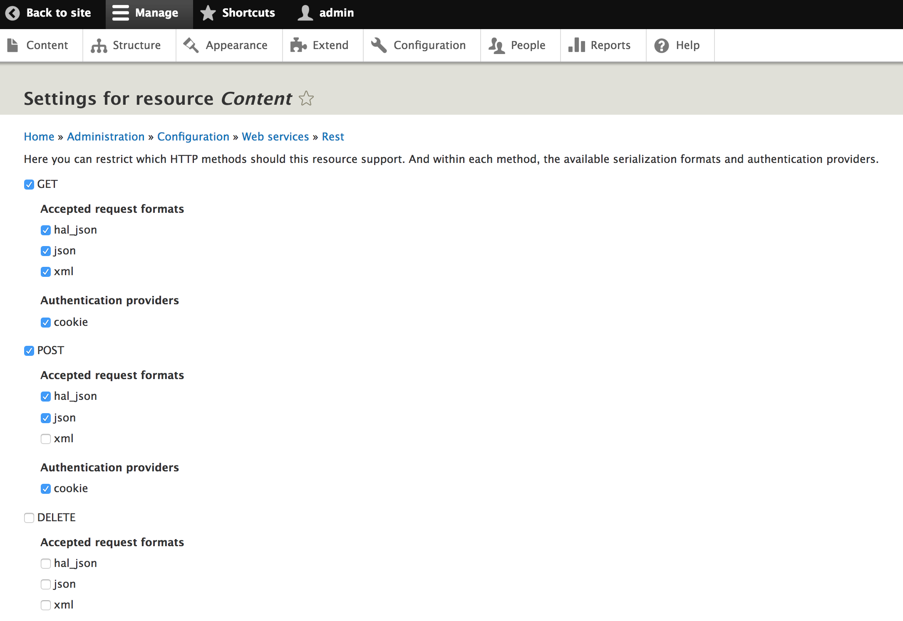

# Web APIs in Drupal 8  <!-- .element: class="front-title" -->

###Abhishek Anand
#### Sr. Technical Architect, ACQUIA


## What are Web Services?

> Representational state transfer (REST) or RESTful Web services are one way of providing interoperability between computer systems on the Internet. REST-compliant Web services allow requesting systems to access and manipulate textual representations of Web resources using a uniform and predefined set of stateless operations. Other forms of Web service exist, which expose their own arbitrary sets of operations such as WSDL and SOAP
Note: Web Services make it possible for other applications to read and update information on your site via the Web. REST is one of a number of different ways of making Web Services available on your site. In contrast to other techniques such as SOAP or XML-RPC, REST encourages developers to rely on HTTP methods (such as GET and POST) to operate on resources (data managed by Drupal).


## REST (Hypermedia)

* Collection of Resources
* Resource identified by URI
* Resource represented in a format
* Manipulate through Verbs/Methods
* Known hyperlinks to other Resources


## Tuitorial
<iframe width="560" height="315" src="https://www.youtube.com/embed/llpr5924N7E" frameborder="0" allowfullscreen></iframe>


## Looking back at Drupal 7
* Not supported by the code
* Anything beyond HTML was a after thought
* Depend on restful or services module
* Not easy to scale


## Whats in Druapl 8?

* The RESTful Web Services module is included in Drupal 8 core
* It is inspired by the Drupal 7 RESTful Web Services module 
* Works out of the box
* Everything's an HTTP Response. Sometimes that's a page.
* You can serve any type of response to a request
* Wire directly to the routing system.
* No duplicating routing anymore!


## Drupal 8 RESTful Drupal Core
   
* RESTful Web Services (rest)
* Serialization (serialization)
* Hypertext Application Language (hal)
* HTTP Basic Authentication (basic_auth)

Note: HAL is a simple format that gives a consistent and easy way to hyperlink between resources in your API.


# REST UI module
A user interface for Drupal 8's REST module.





# DEMO!


# Under the hood!


## RESTful Web Services modules

* Modules can expose additional resources
* Supports GET/POST/PATCH/DELETE (PUT is not supported for good reasons)
* Integrates with Drupal's role-based authentication system automatically: one permission per resource (and per verb)
* Modules can add authentication mechanisms, these are then be applied to any of the resources
* Modules can add more serialization formats 

Note: Put is not supported for a reason https://groups.drupal.org/node/284948


## Serialization
* The Serialization module provides a framework to add additional serialization formats simply by installing additional modules
* Drupal 8 core's HAL module adds support for HAL+JSON, 
* The CSV serialization contrib module adds CSV support.


Using Drupal 8's serializer service's (\Symfony\Component\Serializer\SerializerInterface) serialize() and deserialize() methods:

```php
$output = $this->serializer->serialize($entity, 'json');
$entity = $this->serializer->deserialize($output, \Drupal\node\Entity\Node::class, 'json');

```


## Serialization Workflow


## Normalization
* (array → object → array)
* normalizer (\Symfony\Component\Serializer\Normalizer\NormalizerInterface) 
* denormalizer (\Symfony\Component\Serializer\Normalizer\DenormalizerInterface), 


## Encoder
* Add support for encoding to new serialization formats 

```
/**
* Adds CSV encoder support for the Serialization API.
*/
class CsvEncoder implements EncoderInterface, DecoderInterface {

public function encode($data, $format, array $context = array());

public function supportsEncoding($format);

public function decode($data, $format, array $context = array());

public function supportsDecoding($format);
```


## Authentication
* Session cookies is not the only way to authenticate user supported by drupal core.
* New pluggable authentication system has been introduced.


##Authentication provider services
  Implement 
  ```\Drupal\Core\Authentication\AuthenticationProviderInterface```
   and use the 'authentication_provider' service tag.
 
 
## _auth option on routes
  The default authentication manager (see below) enables developers to limit the set of allowed authentication mechanisms to the specified subset by specifying _auth in a route's options.

Example: 
```_auth: ['basic_auth', 'cookie']```


##Authentication manager

  The authentication manager calls the different authentication provider services based on each service's priority.
  The manager can be overridden for very advanced use cases; 99.9% of the time the default implementation should be sufficient.
  ```\Drupal\Core\Authentication\AuthenticationManager```


## Authentication Modules

* OAuth 
```https://www.drupal.org/project/oauth```
	
* Simple OAuth
```https://www.drupal.org/project/simple_oauth```

* IP Consumer Auth
```https://www.drupal.org/project/ip_consumer_auth```
	
* OAuth2 Server	
 ```https://www.drupal.org/project/oauth2_server```


## AuthenticationProviderInterface

```php
interface AuthenticationProviderInterface {
  
  * Checks whether suitable authentication credentials are on the request.
 public function applies(Request $request);
  
  * Authenticates the user.
 public function authenticate(Request $request);

}
```


```yaml
services:
 vtod_rest.authentication.none:
   class: Drupal\vtod_rest\Authentication\Provider\None
   arguments: ['@session_configuration', '@database']
   tags:
     - { name: authentication_provider, provider_id: 'none', priority: 200, global: TRUE }
```


## Custom REST Resource

* Setup a new custom Drupal module
* Create a new fileDemoResource.php in /src/Plugin/rest/resource/

```php
<?php

namespace Drupal\demo_rest_api\Plugin\rest\resource;

use Drupal\rest\Plugin\ResourceBase;
use Drupal\rest\ResourceResponse;

class DemoResource extends ResourceBase {

}
```


# Thank You!
## Questions?